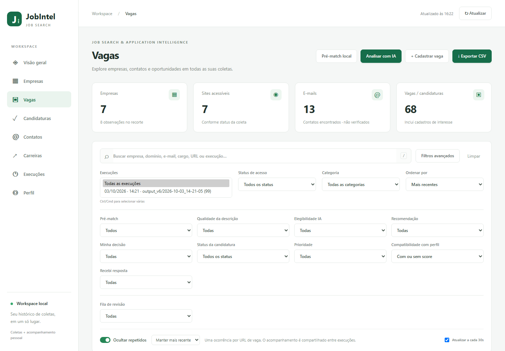
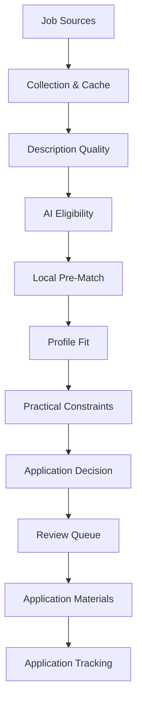
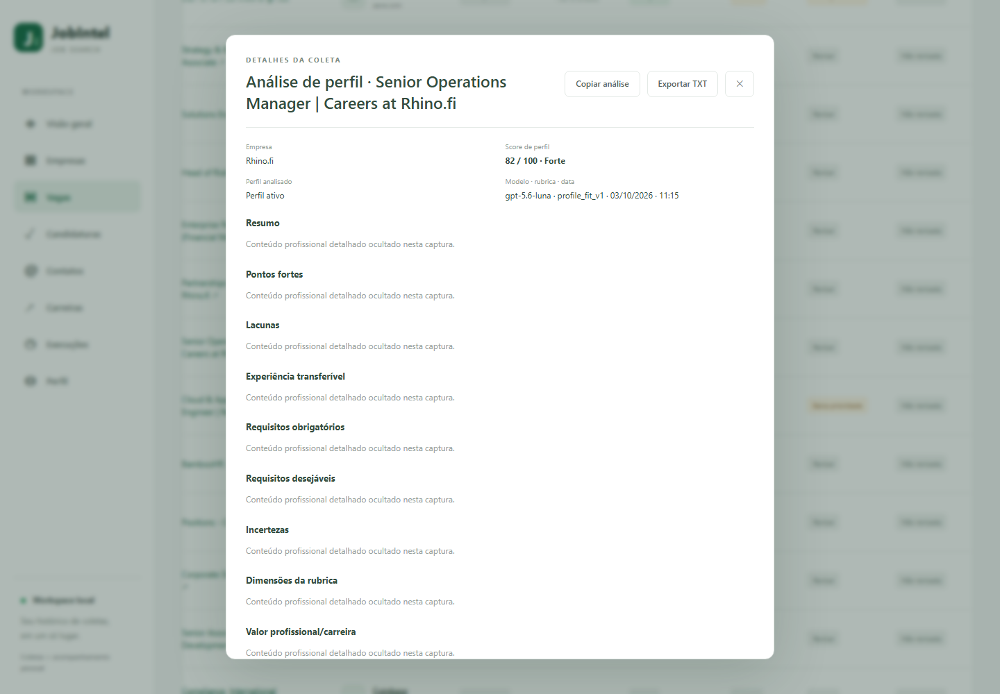
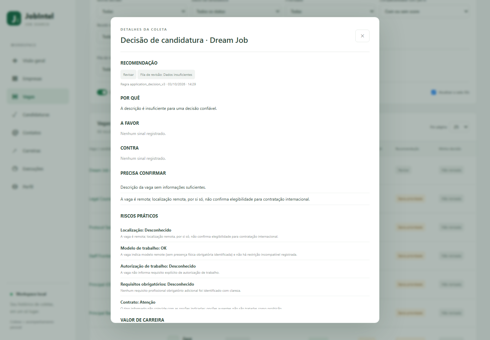
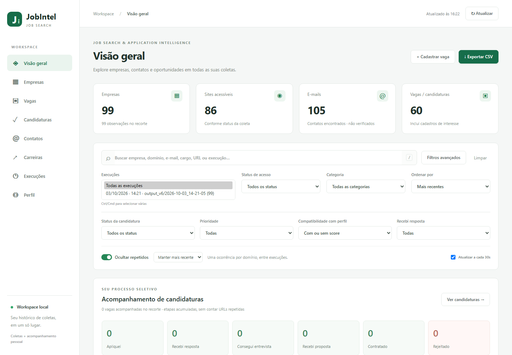

# JobIntel

### Job Search & Application Intelligence

**Turn job hunting into an intelligence workflow.**

JobIntel is a local-first job discovery and application intelligence platform that helps you discover opportunities, qualify job listings, evaluate profile fit, prioritize applications, generate tailored application materials, and track outcomes from one workspace.

Instead of sending every job directly to an AI model, JobIntel combines deterministic analysis, local filtering, caching, and selective AI usage to focus time and API spend on the opportunities that actually deserve deeper evaluation.

**Discover → Qualify → Match → Decide → Apply → Track**


---



## Why JobIntel?

Job searching creates a surprisingly difficult information problem.

You may have hundreds of companies and job listings, but the real questions are:

- Is the job description complete enough to evaluate?
- Does the role actually match my professional background?
- Is it worth spending an AI call on this opportunity?
- Are there geographic, work-model, language, contract, or authorization constraints?
- Which jobs deserve attention first?
- Why should I apply — or not apply?
- How do I keep track of what I already reviewed?
- How do I turn a promising opportunity into a strong application?

JobIntel turns that process into a structured intelligence pipeline instead of a pile of browser tabs and spreadsheets.

---

## Intelligence Pipeline



Not every opportunity needs to reach every stage.

JobIntel deliberately performs inexpensive, deterministic checks before deeper AI analysis. Existing results are cached and versioned where appropriate so the same work does not need to be repeated unnecessarily.

---

## From opportunity to decision

JobIntel separates **matching**, **analysis**, and **decision-making** instead of collapsing everything into a single opaque score.

| Profile Fit | Application Decision |
| --- | --- |
|  |  |

### Profile Fit

Profile Fit performs deeper analysis against the active professional profile and evaluates dimensions such as:

- role fit;
- experience;
- skills;
- seniority;
- domain;
- work model;
- location;
- compensation;
- contract;
- language.

Missing information can remain unknown rather than being automatically treated as a negative signal.

### Application Decision

Application Decision turns the available evidence into a practical review workflow.

It keeps separate:

- system recommendation;
- practical constraints and risks;
- career value;
- information that still needs confirmation;
- the user's own decision.

JobIntel assists the decision. It does not make the final career decision for the user.

---

## Core Features

### 🔎 Discover

Collect and organize job intelligence across configured domains.

- Multi-domain crawling
- HTTP collection with browser fallback
- Job detail enrichment
- Career-page discovery
- Contact discovery
- Deduplication
- Retry and backoff
- `robots.txt` handling
- Resume/checkpoint support
- CSV exports
- SQLite cache

The repository currently includes a `domains.csv` dataset with **2,500+ configured domains**.

### 🧹 Qualify

Determine whether a listing contains enough useful information before spending additional resources on it.

- Description Quality analysis
- AI Eligibility gate
- Deterministic local rules
- Incomplete-description detection
- Local Pre-Match
- Practical specialty filtering

### 🧠 Match

Compare promising opportunities against a versioned professional profile.

- Profile Fit analysis
- Structured fit dimensions
- Strengths and gaps
- Transferable experience
- Mandatory vs. preferred requirements
- Unknown-information handling
- Career-value context
- Cached analysis reuse

### ⚖️ Decide

Turn analysis into an actionable workflow.

- Application Decision
- Practical constraints
- Review Queue
- Prioritization
- Manual user decisions
- Historical decision records

### ✍️ Apply

Generate application material for opportunities that have already survived the earlier stages.

- Tailored cover letters
- Cold email subject lines
- Cold email bodies
- English and Portuguese support
- Generation history
- Cache reuse
- TXT export

Application material is generated for review. **JobIntel does not automatically send applications or emails.**

### 📈 Track

Keep the application lifecycle connected to the original opportunity.

Track stages such as:

- Applied
- Response received
- Interview
- Offer
- Hired
- Rejected

---

## Why this architecture?

### Local-first

Professional profile data, application tracking, analysis history, and workflow state are stored locally.

The dashboard runs locally and uses SQLite for persistent application state.

### Deterministic before AI

AI is not the first step.

JobIntel uses local rules to inspect description quality, eligibility, matching signals, and practical constraints before deciding whether deeper analysis is useful.

### Cost-aware AI

AI calls can be expensive when applied blindly to large collections.

JobIntel therefore combines:

- deterministic gates;
- selective AI usage;
- content hashing;
- result caching;
- version-aware analysis;
- reusable generations.

This allows AI to be used where it provides the most value rather than as a mandatory dependency for every record.

### Human in the loop

JobIntel does not automatically apply to jobs.

The workflow is designed around human review:

```text
Discover
   ↓
Qualify
   ↓
Analyze
   ↓
Review
   ↓
Decide
   ↓
Generate Materials
   ↓
Apply Manually
   ↓
Track
```

### Historical and version-aware

Important analyses are preserved instead of silently replacing previous results.

Changes to the professional profile, job description, model, or analysis rules can therefore produce new records while retaining historical context.

---

## Local Dashboard

JobIntel includes a local dashboard for exploring the collected intelligence and managing the application workflow.



The workspace currently includes:

| Area | Purpose |
| --- | --- |
| **Overview** | High-level view of collected intelligence and application activity |
| **Companies** | Explore companies discovered during collection |
| **Jobs** | Review opportunities, quality, eligibility, matching and recommendations |
| **Applications** | Track jobs that entered the application workflow |
| **Contacts** | Explore discovered company contact information |
| **Careers** | Review discovered career pages |
| **Runs** | Compare crawler executions and collection history |
| **Profile** | Manage the professional profile used for matching and analysis |

The dashboard also supports filtering, deduplication, historical executions, CSV exports, and local application tracking.

---

# Quick Start

## Requirements

The documented setup is currently **Windows-first**.

You will need:

- Python 3.11+
- Chromium installed through Playwright
- an OpenAI API key for optional AI-powered features

Clone the repository:

```powershell
git clone https://github.com/annibalemarcos/jobintel.git
cd jobintel
```

Create and activate a virtual environment:

```powershell
python -m venv .venv
.\.venv\Scripts\Activate.ps1
```

Install dependencies:

```powershell
pip install -r requirements.txt
```

Install the Playwright browser using the project's browser installation script:

```powershell
.\install_browser.bat
```

Copy the environment template:

```powershell
Copy-Item .env.example .env
```

Then configure `.env`:

```env
OPENAI_API_KEY=your_key_here
OPENAI_MODEL=
```

`OPENAI_MODEL` is optional when the project default is appropriate.

Never commit `.env`.

---

## Run the crawler

The crawler accepts a CSV containing domains:

```powershell
python crawler.py domains.csv
```

A fresh collection can be started with:

```powershell
python crawler.py domains.csv --fresh --out output
```

Useful options include:

```text
--limit
--fresh
--out
--resume
--no-ai
--no-robots
--test-api
```

Check the CLI help for the exact options supported by the current version:

```powershell
python crawler.py --help
```

The crawler supports checkpoint/resume behavior, retry/backoff, `robots.txt` handling, HTTP collection, and Playwright fallback where required.

`--no-robots` should only be used deliberately when you understand the implications of bypassing the crawler's normal robots handling.

---

## Run the dashboard

Start the local dashboard:

```powershell
.\dashboard.bat
```

Then open:

```text
http://127.0.0.1:8765
```

---

## Collection Outputs

Depending on the execution mode, crawler output can include files such as:

```text
results_all.csv
results_valid.csv
jobs.csv
checkpoint.json
run_info.json
jobs_cache.sqlite3
```

### `results_all.csv`

Contains collected domain-level results.

### `results_valid.csv`

Contains results that passed the crawler's relevant validation criteria.

### `jobs.csv`

Contains discovered job opportunities and enriched job information when available.

### `checkpoint.json`

Stores execution progress so interrupted crawls can be resumed.

### `run_info.json`

Stores metadata about the collection run.

### `jobs_cache.sqlite3`

Caches job-level collection data so valid information can be reused instead of recollected unnecessarily.

The dashboard uses its own local application database separately from the crawler cache.

Local databases and personal workflow state should not be committed to Git.

---

## AI Usage

JobIntel is **AI-assisted, not AI-dependent**.

The system combines four layers:

```text
Deterministic rules
        +
Local analysis
        +
Selective AI
        +
Caching
```

AI-powered functionality can include deeper Profile Fit analysis and generation of application materials.

The surrounding pipeline remains intentionally deterministic wherever possible.

This makes it possible to collect and organize large amounts of job information without requiring an AI call for every item.

---

## Professional Profile

JobIntel maintains a versioned professional profile used by the matching pipeline.

It can include information such as:

- desired roles;
- areas of interest;
- seniority;
- professional experience;
- skills;
- languages;
- work-model preferences;
- geographic preferences;
- compensation preferences;
- contract preferences;
- relocation preferences.

Profile versions are preserved so historical analyses can remain associated with the context under which they were created.

Import and export through JSON are supported by the dashboard.

---

## Review Queue

The Review Queue helps organize opportunities that require human attention.

Instead of treating every uncertain result equally, JobIntel can distinguish cases that should be reviewed first from opportunities that need more information or can wait.

The queue is derived from existing signals such as:

- description quality;
- AI eligibility;
- pre-match;
- existing Profile Fit;
- practical conflicts;
- current recommendation.

The queue organizes work. It is not itself another matching score.

---

## Application Materials

For selected opportunities, JobIntel can generate:

```text
Cover Letter
Cold Email Subject
Cold Email Body
```

Generation is explicit and user-controlled.

Before a new generation, the application can preview whether an existing result can be reused or whether a new AI call would be required.

Generated material is stored historically and can be copied or exported for manual use.

**Nothing is sent automatically.**

---

## Responsible Crawling

JobIntel is designed to collect public job intelligence while providing controls for responsible crawling.

The crawler includes mechanisms such as:

- `robots.txt` handling;
- request throttling;
- retry/backoff;
- browser fallback;
- checkpoint/resume;
- local caching.

The `--no-robots` option exists as an explicit override and should be used intentionally.

The crawler may still use the legacy technical User-Agent:

```text
SiteIntelCrawler/2.1.4
```

This identifier is intentionally retained for compatibility and does not represent the current product name.

Users are responsible for respecting website terms, applicable policies, and legal requirements when configuring or operating the crawler.

---

## Privacy

JobIntel is designed around a local workspace, but users should still treat collected and generated data carefully.

The repository's `.gitignore` is configured to protect common local artifacts such as:

```text
.env
.dashboard_data/
local SQLite databases
personal profile data
resume/CV files
generated local outputs
logs and caches
```

Before committing changes, it is still good practice to verify:

```powershell
git status
```

Do not commit:

- API keys;
- personal resumes;
- private profile data;
- local application history;
- private notes;
- databases containing personal information.

No local-first architecture can replace normal secret-management and repository hygiene.

---

## Project Structure

A simplified view of the main modules:

```text
jobintel/
│
├── crawler.py
│   └── collection, enrichment and crawler orchestration
│
├── dashboard.py
│   └── local dashboard server
│
├── applications.py
│   └── application/profile persistence
│
├── job_description_quality.py
│   └── deterministic description-quality analysis
│
├── ai_analysis_eligibility.py
│   └── determines whether deeper AI analysis is appropriate
│
├── prematching.py
│   └── deterministic local job/profile pre-match
│
├── profile_fit.py
│   └── structured profile-fit analysis
│
├── application_decision.py
│   └── recommendation and practical decision layer
│
├── application_materials.py
│   └── cover letter and cold email generation
│
├── dashboard_assets/
│   └── dashboard frontend
│
├── scripts/
│   └── supporting project utilities
│
├── docs/
│   └── documentation assets and screenshots
│
└── tests/
    └── Python and JavaScript tests
```

---

## Tests

Run the Python tests with the test command supported by the repository, for example:

```powershell
python -m unittest discover -s tests
```

Individual test modules can also be executed while developing a specific component.

The project also contains JavaScript-side validation for dashboard logic where applicable.

---

## Screenshot Generator

Documentation screenshots can be regenerated from the local dashboard using Playwright:

```powershell
.\.venv\Scripts\python.exe scripts\capture_screenshots.py
```

To watch the browser while the screenshots are captured:

```powershell
.\.venv\Scripts\python.exe scripts\capture_screenshots.py --headed
```

Screenshots are written to:

```text
docs/screenshots/
```

The capture utility is intended to operate against an already-running local dashboard and avoids intentionally mutating application state.

---

## Current Status

JobIntel is an **early-stage project under active development**.

The core workflow is functional:

```text
Collection
→ Quality
→ Eligibility
→ Pre-Match
→ Profile Fit
→ Application Decision
→ Review
→ Materials
→ Tracking
```

However, job descriptions vary enormously across sources, and deterministic heuristics may still require calibration as the system encounters new role types, geographies, work-authorization rules, and listing formats.

JobIntel should not currently be treated as production-ready software.

---

## Roadmap

Potential areas for future development include:

- broader real-world validation;
- improved job-source coverage;
- better geographic and work-authorization reasoning;
- dashboard UX refinements;
- reporting and analytics;
- additional documentation;
- cross-platform setup improvements;
- continued calibration using real-world job listings.

These are directions rather than commitments.

---

## Philosophy

JobIntel is built around a simple idea:

> **AI should help decide where attention is valuable — not make every decision and not process everything blindly.**

A useful job-search system needs more than scraping and more than a single similarity score.

It needs to connect discovery, evidence quality, professional context, practical constraints, human judgment, application preparation, and outcomes.

That's what JobIntel is being built to explore.

---

**JobIntel — Job Search & Application Intelligence**